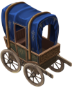

# Carriage

This mod adds a carriage unit to the game costing 100 hammers and 20 horses. It also adds 20 horses as requirement for common wagon trains.

The carriage was intended to carry only units, but the city window does not open when the unit does not have the `carryGoods` ability. It will possibly need a fix in source code for `carryUnits` ability to work as expected.

